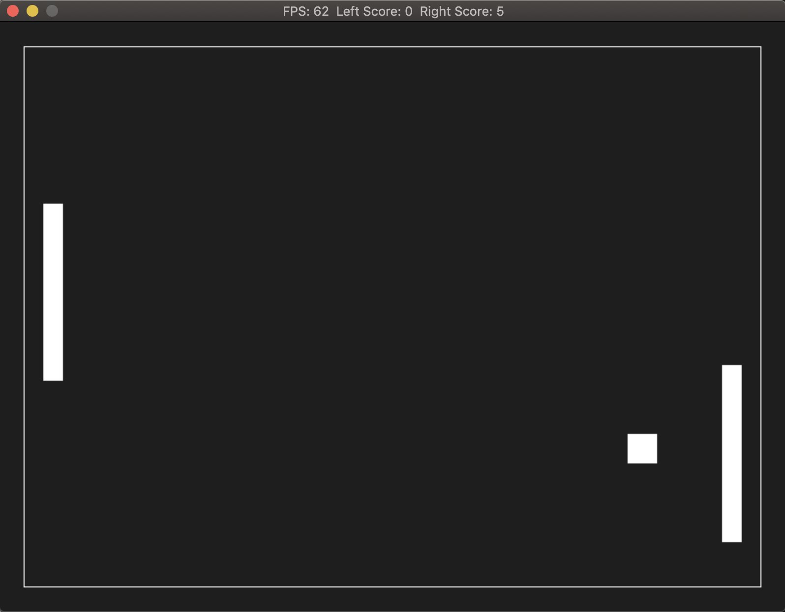

This project has been developed in August 2019 as Capstone Project for the Udacity C++ Nanodegree.
The code for this repo was inspired by [this series of tutorials](https://www.youtube.com/watch?v=ZVk7N8eUjsc) and by [the Snake Game](https://github.com/udacity/CppND-Capstone-Snake-Game.git)

## Basic Build Instructions

1. Clone this repo.
2. Make a build directory in the top level directory: `mkdir build && cd build`
3. Compile: `cmake .. && make`
4. Run it: `./PongGame`.

## Usage
1. Pressing the keys up and down translates the left paddle vertically. The right paddle is fully automated and catches all the balls. Current scores are shown in the title.
2. When closing the window, the final scores are printed as terminal output.

## Class and File Structure
**main.cpp** : defines the constants (width, height, frames per second), creates Renderer, Controller, Game and launches the game. 
**game.cpp** : adds the constitutive elements (the ball and the 2 paddles) to the game, starts an observer thread and controls the animation speed.  
**controller.cpp** : the controller monitors the events (up and down key presses by the user) and controls the manual paddle. 
**renderer.cpp** : the class Renderer contains all the SDL dependencies for rendering an updated window with each frame. 
**paddle.cpp** : the class Paddle is specialized into ManualPaddle and AutoPaddle and defines their geometry and how these objects can move. 
**ball.cpp** : the class ball defiens the geometry of the ball and how it can move. 

## Rubric Points :
**The project accepts user input and processes the input.**  
The user can press the up and down key to move the left paddle : see class Controller. 
**The project uses Object Oriented Programming techniques.** 
The project is clearly organized following the Model View Controller pattern where the model is represented by the Game class (containing the paddles and the ball), the View is provided by the Renderer and the Controller by the Controller. 
**Class constructors utilize member initialization lists.** 
Check for example constructors for Paddle and Ball. 
**Classes use appropriate access specifiers for class members.** 
All members are specified either public, protected or private. Check for example ball.h and paddle.h. 
**The project makes use of references in function declarations.** 
Check for example render method (class Renderer) or the method follow (class AutoPaddle in paddle.cpp). 
**The project uses scope / Resource Acquisition Is Initialization (RAII) where appropriate.** 
Implicit call of the destructor for Renderer, see main.cpp .
**The project uses multithreading.** 
An observer thread is created (in Game::run) to send output to the terminal while the game is running and to output the final results.  

